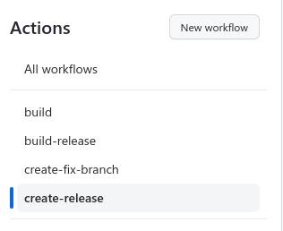
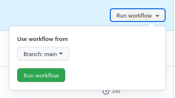
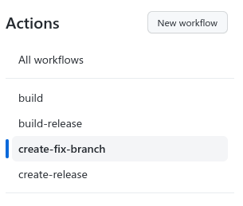
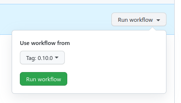

# Common pipelines

Common pipelines

### Helm build

Source: `helm-build.yml`

Build and publish helm package to repository `oci://ghcr.io/${{ github.repository_owner }}`.

For pure helm project create a file `.github/workflows/build.yml`

```yaml
name: build
on:
  push:
    branches:
      - 'main'
      - 'fix/[0-9]+.[0-9]+.x'
  pull_request:

jobs:
  java:
    uses: onecx/ci-common/.github/workflows/helm-build.yml@v1
    secrets: inherit
    with:      
      artifact: ''    
      helmdir: '.'
```

To integration in the application pipe use this include and set up these variables:

```yaml
  helm:
    uses: onecx/ci-common/.github/workflows/helm.yml@main
    needs: docker
    secrets: inherit
    with:
      helmdir: 'target/helm'
      samoHelmSourceDir: src/main/helm
      samoHelmSourceCopy: true
```

### Helm release

Source: `helm-release.yml`

Release helm package from repository `oci://ghcr.io/${{ github.repository_owner }}`.

For pure helm project create a file `.github/workflows/build-release.yml`.

```yaml
name: build-release
on:
  push:
    tags:
      - '**'
jobs:
  java:
    uses: onecx/ci-common/.github/workflows/helm-release.yml@v1
    secrets: inherit
```

To integration in the application pipe use this include and set up these variables:

```yaml
  helm:
    uses: onecx/ci-common/.github/workflows/helm-release.yml@main
    needs: docker
    secrets: inherit
```

### Docker build

Source: `docker-build.yml`

Build and publish docker image to `ghcr.io/${{ github.repository_owner }}`

To integration in the application pipe use this include and set up these variables:

```yaml
  docker:
    uses: onecx/ci-common/.github/workflows/docker-build.yml@v1
    needs: java
    secrets: inherit
    with:
      samoDockerFile: src/main/docker/Dockerfile
      artifact: package
```

### Docker release

Source: `docker-release.yml`

Release docker image from `ghcr.io/${{ github.repository_owner }}`

To integration in the application pipe use this include and set up these variables:

```yaml
  docker:
    uses: onecx/ci-common/.github/workflows/docker-release.yml@main
    needs: docker
    secrets: inherit
```

### Create release

> This is manual action.

Create `.github/workflows/create-release.yml` file for create a release actions.

```yaml
name: create-release
on:
  workflow_dispatch:
jobs:
  release:
    uses: onecx/ci-java-lib/.github/workflows/create-release.yml@v1
    secrets: inherit
```

To create a release open the project page `Actions` and select `create-release` action from the list.



Select a branch to create a new release for and run the workflow.



### Create fix branch

> This is manual action.

Create `.github/workflows/create-fix-branch.yml` file for create fix branch actions.

```yaml
name: create-fix-branch
on:
  workflow_dispatch:
jobs:
  fix:
    uses: onecx/ci-java-lib/.github/workflows/create-fix-branch.yml@v1
    secrets: inherit
```

To create a fix branch open the project page `Actions` and select `create-fix-branch` action from the list.



Select a tag `x.x.0` to create a new fix branch for and run the workflow.




### Generate changelog

Your can include changelog generator to your pipeline.Create a file `.github/changelog.yaml`

* secions - define custom section by ticket labels
* template - custom template to generate secions

For example:

`````yaml
sections:
- title: Major changes
  labels:
    - "release/super-feature"
- title: Complete changelog
  labels:
    - "bug"
    - "enhancement"
    - "dependencies"
template: |
  My project description

  Here are the sections generated:

  {{ range $section := .Sections }}{{ if $section.Items }}### {{ $section.GetTitle }}{{ range $item := $section.Items }}
  * [#{{ $item.GetID }}]({{ $item.GetURL }}) - {{ $item.GetTitle }}{{ end }}{{ end }}
  {{ end }}
`````
> More documentation in the [changelog](https://github.com/lorislab/changelog) page.

Include to the project release pipeline (actions for `tag`):

```yaml
  changelog:
    uses: onecx/ci-common/.github/workflows/generate-changelog.yml@v1
    secrets: inherit
```

## Samo

Samo tool is use to build `docker`, `helm` or `release` of the application.

### Samo common configuration

```shell
  # release tag message
  SAMO_RELEASE_MESSAGE_TEMPLATE: '{{ .Release }}'
  # release tag name
  SAMO_RELEASE_TAG_TEMPLATE: '{{ .Release }}'
  # first version for empty repository
  SAMO_FIRST_VERION: '0.0.0'
  # template for version
  SAMO_VERSION_TEMPLATE: '{{ .Version }}-rc.{{ .Count }}'
  # use conventional commits for version calculation
  SAMO_CONVENTIONAL_COMMITS: 'true'
  # fix branch pattern
  SAMO_BRANCH_TEMPLATE: 'fix/{{ .Major }}.{{ .Minor }}.x'
  # skip samo labels for docker images and helm chart (created,hash,version)
  SAMO_SKIP_SAMO_LABELS: 'false'
  # skip push action (release, docker release, helm release, ...)
  SAMO_SKIP_PUSH: 'false'
  # custom labels for docker and helm images
  # SAMO_LABELS_TEMPLATE_LIST: ''

  # Samo docker configuration

  # path to the Dockerfile in the project
  SAMO_DOCKER_FILE: src/main/docker/Dockerfile
  # docker registry
  SAMO_DOCKER_REGISTRY: ghcr.io
  # docker registry group
  SAMO_DOCKER_GROUP: '${{ github.repository_owner }}/'
  # docker tag template
  SAMO_DOCKER_TAG_TEMPLATE_LIST: '{{ .Version }},{{ .Branch }}'  
  # docker release registry
  SAMO_DOCKER_RELEASE_REGISTRY: ghcr.io
  # docker release group
  SAMO_DOCKER_RELEASE_GROUP: '${{ github.repository_owner }}/'
  # skip opencontainers labels
  SAMO_DOCKER_SKIP_OPENCONTAINERS_LABELS: 'false'
  # docker build context
  SAMO_DOCKER_CONTEXT: '.'
  # skip pull new images before build
  SAMO_DOCKER_SKIP_PULL: 'false'
  # skip push docker image to remote registry after build
  SAMO_DOCKER_BUILD_PUSH: 'false'
  # skip build dev docker image <project_name>:latest. This is use in the integration test
  SAMO_DOCKER_SKIP_DEV: 'false'
  # skip remote intermediate images after build
  SAMO_DOCKER_REMOVE_INTERMEDIATE_IMG_SKIP: 'false'

  # Samo helm configuration

  # helm chart source directory will be use only if SAMO_HELM_SOURCE_COPY=true
  SAMO_HELM_SOURCE_DIR: src/main/helm
  # copy and filter helm chart from source diretory to target directory SAMO_HELM_DIR
  SAMO_HELM_SOURCE_COPY: 'false'
  # helm push URL
  SAMO_HELM_PUSH_URL: ${HARBOR_HELM_TKIT_API}
  # helm repository name (alias)
  SAMO_HELM_REPO: 1000kit
  # helm repository URL
  SAMO_HELM_REPO_URL: ${HARBOR_HELM_TKIT}
  # helm repository username
  SAMO_HELM_REPO_USERNAME: ${HARBOR_USERNAME}
  # helm repository password
  SAMO_HELM_REPO_PASSWORD: ${HARBOR_PASSWORD}
  # helm repository target directory (after filter)
  SAMO_HELM_DIR: target/helm
  # update values in Chart.yaml file
  SAMO_HELM_CHART_TEMPLATE_LIST: 'version={{ .Version }},appVersion={{ .Version }},name={{ .Name }}'
  # update values in the values.yaml file
  SAMO_HELM_VALUES_TEMPLATE_LIST: "app.image.registry=${SAMO_DOCKER_REGISTRY},app.image.tag={{ .Version }},app.image.repository=${{ github.repository_owner }}/{{ .Name }}"
  # type of the push, harbor = form upload
  SAMO_HELM_PUSH_TYPE: 'harbor'
  # update values in values.yaml file for the release
  SAMO_HELM_VALUES_RELEASE_TEMPLATE_LIST: "app.image.registry=${SAMO_DOCKER_RELEASE_REGISTRY},app.image.tag={{ .Release }},app.image.repository=${{ github.repository_owner }}/{{ .Name }}"
  # update values in Chart.yaml file for the release
  SAMO_HELM_CHART_RELEASE_TEMPLATE_LIST: 'version={{ .Release }},appVersion={{ .Release }},name={{ .Name }}'
```